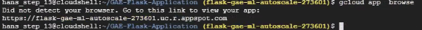
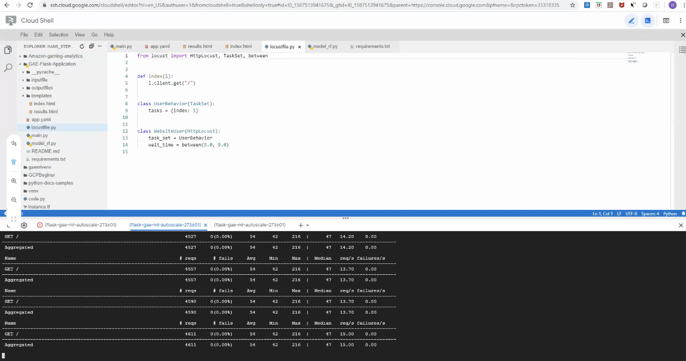
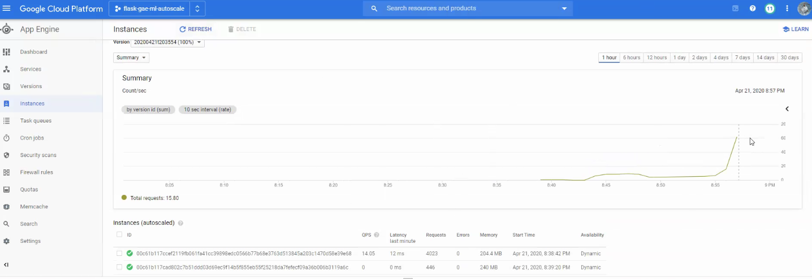

# GAE-Flask-Application


#### Deploy Appengine App
```
$ gcloud app deploy
```
#### List all app version  
```
$ gcloud app versions list
SERVICE  VERSION.ID       TRAFFIC_SPLIT  LAST_DEPLOYED              SERVING_STATUS
default  20200403t133612  0.00           2020-04-03T13:43:20-04:00  STOPPED
default  20200403t142656  1.00           2020-04-03T14:29:37-04:00  SERVING
```
#### Browse app
```
$ gcloud app browse
```



#### You can stream logs from the command line by running:
```
  $ gcloud app logs tail -s default  

```


### Locoust Load testing instructions.

#### Install Locoust load testthrough cli

```
sudo python3 -m pip install locustio
```
#### Run Locoust load test
```
$ locust
```

```
$ locust -f locustfile.py --no-web --host https://flask-gae-ml-autoscale-273601.uc.r.appspot.com -c 10 -r 1
```

#### app instances list

```
$ gcloud app instances list
SERVICE  VERSION          ID                                                                        VM_STATUS  DEBUG_MODE
default  20200404t000535  00c61b117c0e358b4f39351e31c7cbbb4a42eeccf5c8e79c67ffadb5bc90c36d16176c28  N/A
default  20200404t000535  00c61b117c1316418d0ddc5f63ba320f4e5f6c33da5f92b06ee4448c1b1620aa73d82e0c  N/A
default  20200404t000535  00c61b117c23d72c2dc77c392bb5d7f0524a288cba7c32483c6b10fd7a12dace6a89e525  N/A
default  20200404t000535  00c61b117c3da9a1cae3f6fad5c7d9c7e964d1d0d3a7c4cf4e82209f217db46e0e1b1466  N/A
default  20200404t000535  00c61b117c4630017427a019c195e79fddc6689690148d9541ecb402543f41b3265e15    N/A
default  20200404t000535  00c61b117c7a46d0f08f90e179410464eb31977df1a3c34c4e172bf2d7cb59c6c994d458  N/A
default  20200404t000535  00c61b117ce32c112aaf8289288201a9845bea7e76c0f6c742a9cb737e124c4fb2904fc1  N/A

```
#### Run Locoust in cli


#### Instance Autoscaled graph.  


